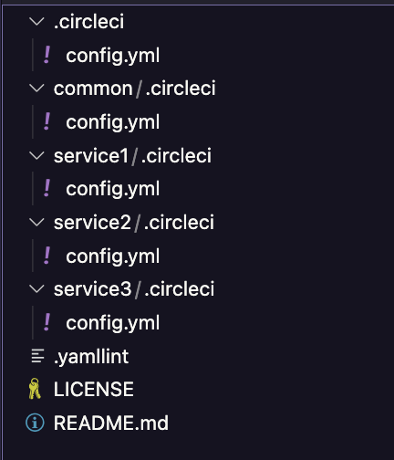

# Split Config Orb

[](https://circleci.com/gh/bufferings/orb-split-config) [](https://circleci.com/orbs/registry/orb/bufferings/orb-split-config) [](https://raw.githubusercontent.com/bufferings/orb-split-config/master/LICENSE) [](https://discuss.circleci.com/c/ecosystem/orbs)

## Are you having trouble with a large configuration file?

Here is Split Config Orb for you!

You no longer have to tire of managing one huge configuration file. With this Orb, you can split the `config.yml` into multiple files. The split configs are merged when CircleCI starts.

## Getting Started

### `config.yml` file

It's super simple, you just need to prepare the following `config.yml`:

```yaml
version: 2.1

setup: true

orbs:
  # Please specify the latest version
  split-config: bufferings/split-config@1.2.3

workflows:
  generate-config:
    jobs:
      - split-config/generate-config:
          find-config-regex: .*/\.circleci/config\.yml
```

The Orb finds the split config files according to the regex, merges them, and starts a CircleCI pipeline with the merged config.

### Enable Dynamic Config

This Orb uses the [Dynamic Config](https://circleci.com/docs/dynamic-config) feature of CircleCI. By default, the feature is disabled, so please [enable the feature](https://circleci.com/docs/dynamic-config#getting-started-with-dynamic-config-in-circleci) to get started.

## How to use

### I want to use regex to find the split configs

You can use regex to specify config paths. Actually, it uses `find` command with the regex. Please use relative paths to the working directory.

**Regex Example1**

For example, if your repository structure is like this:



The `config.yml` is like this:

```yaml
version: 2.1

setup: true

orbs:
  # Please specify the latest version
  split-config: bufferings/split-config@1.2.3

workflows:
  generate-config:
    jobs:
      - split-config/generate-config:
          find-config-regex: .*/\.circleci/config\.yml
```

Working example: https://github.com/bufferings/orb-split-config-example1

> **Note**
> The Orb ignores `./.circleci/config.yml` file. Specifically, it automatically adds `-not -regex "\./\.circleci/config\.yml"` option.

**Example2**

Here is another regex example. If you put configs under `.circleci/configs` directory, it will be like this:

```yaml
version: 2.1

setup: true

orbs:
  # Please specify the latest version
  split-config: bufferings/split-config@1.2.3

workflows:
  generate-config:
    jobs:
      - split-config/generate-config:
          find-config-regex: \./\.circleci/configs/.*\.yml
```

Working example: https://github.com/bufferings/orb-split-config-example2

### I want to write the split config paths in the `config.yml`

You can set the fixed paths in your `config.yml`. Please use relative paths to the working directory.

```yaml
version: 2.1

setup: true

orbs:
  # Please specify the latest version
  split-config: bufferings/split-config@1.2.3

workflows:
  generate-config:
    jobs:
      - split-config/generate-config:
          fixed-config-paths: |
            ./common/.circleci/config.yml
            ./service1/.circleci/config.yml
            ./service2/.circleci/config.yml
            ./service3/.circleci/config.yml
```

Working example: https://github.com/bufferings/orb-split-config-example3

### I want to write the split config paths in a file

You can also use a file to specify the fixed list. Please use relative paths to the working directory.

```shell
❯ cat .circleci/config-list
./common/.circleci/config.yml
./service1/.circleci/config.yml
./service2/.circleci/config.yml
./service3/.circleci/config.yml
```

```yaml
version: 2.1

setup: true

orbs:
  # Please specify the latest version
  split-config: bufferings/split-config@1.2.3

workflows:
  generate-config:
    jobs:
      - split-config/generate-config:
          config-list-path: .circleci/config-list
```

Working example: https://github.com/bufferings/orb-split-config-example4

### I want to use all the ways to specify config paths

You can!

```yaml
version: 2.1

setup: true

orbs:
  # Please specify the latest version
  split-config: bufferings/split-config@1.2.3

workflows:
  generate-config:
    jobs:
      - split-config/generate-config:
          config-list-path: .circleci/config-list
          fixed-config-paths: |
            ./service1/.circleci/config.yml
            ./service2/.circleci/config.yml
          find-config-regex: \./service3/\.circleci/configs/.*\.yml

```

Working example: https://github.com/bufferings/orb-split-config-example5


### I want to use Split Config Orb with path-filtering Orb

You can pass the generated config to path-filtering using workspace.

```yaml
version: 2.1

setup: true

orbs:
  # Please specify the latest version
  split-config: bufferings/split-config@1.2.3
  path-filtering: circleci/path-filtering@1.2.3

workflows:
  generate-config:
    jobs:
      - split-config/generate-config:
          find-config-regex: .*/\.circleci/.*\.yml
          generated-config-path: /tmp/generated_config.yml
          continuation: false
          post-steps:
            - persist_to_workspace:
                root: /tmp
                paths:
                  - generated_config.yml
      - path-filtering/filter:
          workspace_path: /tmp
          config-path: /tmp/generated_config.yml
          mapping: |
            service1/.* build-service1 true
            service2/.* build-service2 true
          requires:
            - split-config/generate-config
```

Working example: https://github.com/bufferings/orb-split-config-example6

## How it works

The Split Config Orb uses CUE to merge the YAML files.

* CUE https://cuelang.org/

Therefore, it follows the CUE specification to merge the files.

## Restrictions

There're some restrictions coming from the mechanism behind this Orb.

You need to be careful not to use the same name for Jobs and Workflows. Since it is merged into one YAML file in the end, you can't use the same Job name nor Workflow name.

YAML anchors and aliases need to be in the same YAML file. When CUE import YAML, it parse the anchors and aliases in the file. Therefore, you can't put anchors and aliases into different files separately.

## (Advanced) I want to use CUE to write CircleCI config

```yaml
```

---

## Resources

[CircleCI Orb Registry Page](https://circleci.com/orbs/registry/orb/bufferings/split-config) - The official registry page of this orb for all versions, executors, commands, and jobs described.

[CircleCI Orb Docs](https://circleci.com/docs/2.0/orb-intro/#section=configuration) - Docs for using, creating, and publishing CircleCI Orbs.

### How to Contribute

We welcome [issues](https://github.com/bufferings/orb-split-config/issues) to and [pull requests](https://github.com/bufferings/orb-split-config/pulls) against this repository!

### How to Publish An Update
1. Merge pull requests with desired changes to the main branch.
    - For the best experience, squash-and-merge and use [Conventional Commit Messages](https://conventionalcommits.org/).
2. Find the current version of the orb.
    - You can run `circleci orb info bufferings/split-config | grep "Latest"` to see the current version.
3. Create a [new Release](https://github.com/bufferings/orb-split-config/releases/new) on GitHub.
    - Click "Choose a tag" and _create_ a new [semantically versioned](http://semver.org/) tag. (ex: v1.0.0)
      - We will have an opportunity to change this before we publish if needed after the next step.
4.  Click _"+ Auto-generate release notes"_.
    - This will create a summary of all of the merged pull requests since the previous release.
    - If you have used _[Conventional Commit Messages](https://conventionalcommits.org/)_ it will be easy to determine what types of changes were made, allowing you to ensure the correct version tag is being published.
5. Now ensure the version tag selected is semantically accurate based on the changes included.
6. Click _"Publish Release"_.
    - This will push a new tag and trigger your publishing pipeline on CircleCI.
